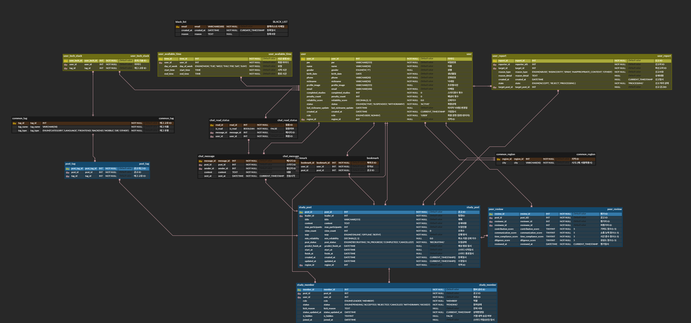

# be25-1st-Linker-FitStudy
<p align="center">
  
</p>

<h1 align="center">📛 <strong>[FIT-STUDY]</strong></h1>
<p align="center"><em>나에게 딱 맞는(Fit) 스터디</em></p>

<p align="center">
  막막한 스터디 찾기, 이제 핏터디가 당신에게 가장 잘 맞는 곳을 연결해 드립니다. <br />
  <strong>당신의 열정에 딱 맞는 자리를 찾아드립니다.</strong>
</p>

---

<p align="center">
  
</p>

## 📚 Table of Contents

- [👥 팀원 소개](#-팀원-소개)
- [🌟 프로젝트 개요](#-프로젝트-개요)
- [💡 개발 배경 및 필요성](#-개발-배경-및-필요성)
- [🔧 주요 기능](#-주요-기능)
- [📅 프로젝트 진행 일정 (WBS)](#-프로젝트-진행-일정-wbs)
- [📋 요구사항 명세](#-요구사항-명세)
  - [✅ 기능 요구사항](#-기능-요구사항)
  - [🚫 비기능 요구사항](#-비기능-요구사항)
- [🧩 데이터베이스 설계](#-데이터베이스-설계)
  - [📌 ERD 구조도](#erd-구조도)
  - [📋 테이블 명세](#-테이블-명세)
  - [📌 아키텍처](#아키텍처)
  - [📌 Schema DDL](#schema-ddl)
- [🧪 샘플 데이터 (DML)](#-샘플-데이터-dml)
- [🧠 구현 결과 (Code & Procedure)](#-구현-결과-code--procedure)
- [💬 시나리오](#-시나리오)
- [🔧 수정 및 향후 개선사항](#-수정-및-향후-개선사항)
- [🎓 회고록](#-회고록)

---

## 👥 팀원 소개

<p align="center">
  
</p>

| <br>**이다윗** | <br>**김다솜** | <br>**이애은** |
| :---: | :---: | :---: |
| **팀장 / [담당역할]** | **팀원 / [담당역할]** | **팀원 / [담당역할]** |
| <a href="[깃허브 주소]"></a> | <a href="[깃허브 주소]"></a> | <a href="[깃허브 주소]"></a> |

<br>

| <br>**윤정윤** | <br>**이용호** | <br>**박재하** |
| :---: | :---: | :---: |
| **팀원 / [담당역할]** | **팀원 / [담당역할]** | **팀원 / 스터디 관리 및 리더 기능** |
| <a href="[깃허브 주소]"></a> | <a href="[깃허브 주소]"></a> | <a href="https://github.com/horolo1234"></a> |
---

## 💡 **배경**

- 최근 협업 환경이 **비대면 및 온·오프라인 혼합형으로 변화**함에 따라 **팀 기반 학습 비중이 급격히 증가**하면서 **스터디 빈도가 어느 때보다 높아짐.**
- 그러나 여전히 많은 사람들은 단순히 '아는 사람' 위주로 팀을 구성, 성향과 역량을 알지 못한 채, **무작위로 팀원을 만나면서 큰 피로감과 갈등을 유발함**.
- 따라서 **팀원 평가**를 통해 **공정한 팀 구성과 각자의 책임 있는 참여를 보장**할 수 있는 **매칭 시스템 및 협업 이력 관리 시스템의 도입이 필요할 것으로 판단**되어 프로젝트를 기획함.

---

## 🎯 **서비스 목표**

- **데이터 기반 매칭** : 태그 일치율 기반의 추천 알고리즘**과 **상세 필터링**을 통해 팀 구성에 소모되는 **탐색 비용 및 불일치 리스크 최소화.**
- **투명한 이력 관리** : 스터디 완수, 중도 포기, 강제 퇴장 등 **모든 협업 이력을 데이터화**하여 관리.
- **신뢰 중심 시스템** : **상호 평가 시스템**을 통해 성실한 유저가 우대받고, 불성실한 유저는 페널티를 받는 **자정 작용 시스템 구축**.

---

## 👤 **핵심 가치 및 전략**

- **신뢰 지수의 가시화** : 기여도·소통능력·시간준수·성실도를 **종합한 '신뢰 지수'를 도입**하여 **사용자의 협업 능력**을 **가시화하여 평가 가능.**
- **책임감 강화** : 팀장에게는 불성실한 팀원에 대한 **'강제 퇴장' 권한**을, 팀원에게는 **‘상호 평가 권한’을 부여**하여 책임감 있는 참여 유도.

## 🔧 주요 기능

**1. 회원 및 프로필 관리**

- **상세 프로필 구성 :** 기본 정보(사진, 주소 등) 외 **기술 스택, 협업 성향, 활동 가능 시간대**를 등록하여 매칭 정확도 향상.
- **신뢰 정보 공개 :** 타 사용자가 내 프로필 조회 시 **과거 스터디 완수 횟수, 패널티 횟수, 신뢰 지수**를 투명하게 공개하여 상호 신뢰 형성.

**2. 스터디 모집 및 팀 관리 *(팀장 기능)***

- **정밀한 모집 필터링 :** 스터디 생성 시 온/오프라인 여부, 지역, 모집 기간 설정뿐만 아니라, 지원자의 **기술 스택** 및 **최소 신뢰 지수** 제한 조건을 설정하여 팀원 선별.
- **팀원 관리 권한**
    - **강제 퇴장 및 페털티 부여 :**
        - 부적절/불성실 멤버 **강제 탈퇴 처리 가능,**
        - 강제 퇴장 시 **해당 팀원의 기여도는 0점 처리**되며, 협업 횟수 및 점수가 롤백되는 제재 기능 추가.
    - **팀장 위임:** 팀장 탈퇴 시 평점이 높은 팀원에게 권한 자동 위임.

**3. 맞춤 매칭 및 검색 *(팀원 기능)***

- **태그 기반 추천 알고리즘 :** 사용자의 태그와 스터디 공고의 **태그 일치율을 분석**하여 **적합도 점수** 산정 및 상단 노출.
- **다차원 검색 필터 :** 기술 스택별, 지역별, 온/오프라인 여부, 모집 상태(모집중/완료)로 **상세 검색 제공**.
- **관심 공고 관리 :** **북마크(찜하기) 기능**을 통한 **관심 스터디 목록 관리 및 실시간 지원 현황** (참여중 상태 필터링) **조회**.

**4. 팀 소통 및 협업 도구**

- **실시간 팀 채팅 :** 팀 생성 완료 시 **해당 멤버만 접근 가능한 채팅방 자동 생성**.
- **자료 공유 아카이브 :** 스터디 관련 문서(PDF, 이미지) **업로드** 및 채팅방 **내 공유 파일 모아보기 기능** 제공.

**5. 다면 평가 및 신뢰도 산정**

- **상호 평가 시스템 :** 스터디 정상 종료(완수) 시, **팀원 간 4가지 항목(기여도, 소통 능력, 시간 준수, 성실도)**에 대해 **5점 만점 평가 진행**.
- **신뢰 지수 알고리즘 :** **팀원들로부터 받은 평가 점수의 평균을 산출**하여 개인의 고유 ‘**신뢰 지수’**로 환산 및 누적 관리.

**6. 관리자(Admin) 및 신고 시스템**

- **클린 캠페인 관리 :** **허위 모집 공고 삭제** 및 부적절한 댓글 관리.
- **블랙리스트 제도 :** **신고 누적 유저**에 대한 **서비스 이용 정지** 및 내부 심사를 통한 **강제 탈퇴**(페널티 3회 누적 시) 처리.
- **대시보드 :** 신규 스터디 생성 추이 및 유입 인원 통계 모니터링.

---

## 📅 프로젝트 진행 일정 (WBS)


- [📂 일정표 자세히 보기 (링크)]([https://docs.google.com/spreadsheets/d/1rJIUxV4W8rlf0Q7GiBcsVRYuY1JH6BskKCvWa9DXjHo/edit?gid=0#gid=0])

---

## 📋 요구사항 명세

### 🧾 요구사항 정의서

- [📂 요구사항 정의서 링크]([링크])

### ✅ 기능 요구사항
- [기능 1]
- [기능 2]

### 🚫 비기능 요구사항
- [보안, 성능 등]
- [환경 제약 사항]

---

## 🧩 데이터베이스 설계

### 📌 ERD 구조도


### 📋 테이블 명세
- [📂 테이블 명세서 링크]([링크])

### 📌 아키텍처


### 📌 Schema DDL

```sql
-- 예시 테이블 생성 구문
CREATE TABLE Example (
    id INT PRIMARY KEY AUTO_INCREMENT,
    name VARCHAR(100),
    created_at DATETIME DEFAULT NOW()
);
