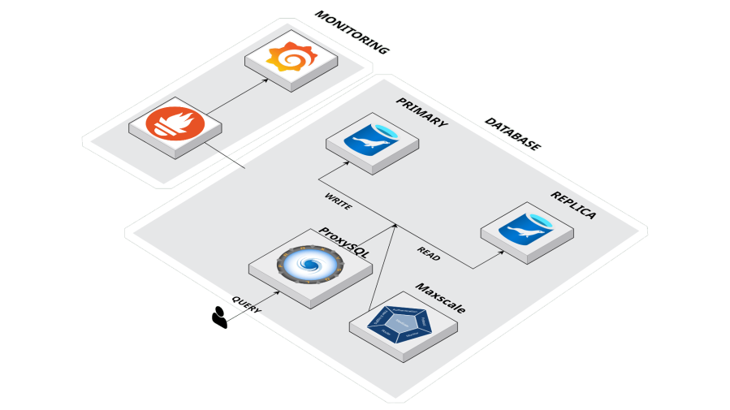

<p align="center">
  
</p>

<h1 align="center">📛 <strong>[FIT-STUDY]</strong></h1>
<p align="center"><em>나에게 딱 맞는(Fit) 스터디</em></p>

<p align="center">
  막막한 스터디 찾기, 이제 핏터디가 당신에게 가장 잘 맞는 곳을 연결해 드립니다. <br />
  <strong>당신의 열정에 딱 맞는 자리를 찾아드립니다.</strong>
</p>

---

<p align="center">
  
</p>

## 📚 Table of Contents

- [👥 팀원 소개](#-팀원-소개)
- [🌟 프로젝트 개요](#-프로젝트-개요)
- [💡 개발 배경 및 필요성](#-개발-배경-및-필요성)
- [🔧 주요 기능](#-주요-기능)
- [📅 프로젝트 진행 일정 (WBS)](#-프로젝트-진행-일정-wbs)
- [📋 요구사항 명세](#-요구사항-명세)
  - [✅ 기능 요구사항](#-기능-요구사항)
  - [🚫 비기능 요구사항](#-비기능-요구사항)
- [🧩 데이터베이스 설계](#-데이터베이스-설계)
  - [📌 ERD 구조도](#erd-구조도)
  - [📋 테이블 명세](#-테이블-명세)
  - [📌 아키텍처](#아키텍처)
  - [📌 Schema DDL](#schema-ddl)
- [🧪 샘플 데이터 (DML)](#-샘플-데이터-dml)
- [🧠 쿼리 실행 결과 (Code)](#-구현-결과-code)
- [🔧 수정 및 향후 개선사항](#-수정-및-향후-개선사항)
- [💻테스트)
- [🎓 회고록]

---

## 👥 팀원 소개

<p align="center">
  
</p>

| <br>**이다윗** | <br>**김다솜** | <br>**이애은** |
| :---: | :---: | :---: |
| **팀장 / 운영 및 제재 관리** | **팀원 / 상호작용 및 커뮤니케이션** | **팀원 / 스터디 탐색 및 조회** |
| <a href="https://github.com/Dawit-lee"></a> | <a href="https://github.com/Myang09"></a> | <a href="https://github.com/nueeaeel"></a> |

<br>

| <br>**윤정윤** | <br>**이용호** | <br>**박재하** |
| :---: | :---: | :---: |
| **팀원 / 마이페이지 및 개인화** | **팀원 /  회원 기초 및 인증** | **팀원 / 스터디 관리 및 리더 기능** |
| <a href="https://github.com/penep0"></a> | <a href="[깃허브 주소]"></a> | <a href="https://github.com/horolo1234"></a> |
---

## 💡 **배경**

- 최근 협업 환경이 비대면 및 온·오프라인 혼합형으로 변화함에 따라 팀 기반 학습 비중이 급격히 증가하면서 스터디 빈도가 어느 때보다 높아짐.
- 그러나 여전히 많은 사람들은 단순히 '아는 사람' 위주로 팀을 구성, 성향과 역량을 알지 못한 채, 무작위로 팀원을 만나면서 큰 피로감과 갈등을 유발함.
- 따라서 **팀원 평가**를 통해 공정한 팀 구성과 각자의 **책임 있는 참여를 보장**할 수 있는 **매칭 시스템 및 협업 이력 관리 시스템의 도입이 필요성**을 느껴 프로젝트를 기획함.

---

## 🎯 **서비스 목표**

- **데이터 기반 매칭** : 태그 일치율 기반의 추천 알고리즘과 상세 필터링을 통해 팀 구성에 소모되는 탐색 비용 및 불일치 리스크 최소화.
- **투명한 이력 관리** : 스터디 완수, 중도 포기, 강제 퇴장 등 모든 협업 이력을 데이터화하여 관리.
- **신뢰 중심 시스템** : 상호 평가 시스템을 통해 성실한 유저가 우대받고, 불성실한 유저는 페널티를 받는 자정 작용 시스템 구축.

---

## 👤 **핵심 가치 및 전략**

- **신뢰 지수의 가시화** : 기여도·소통능력·시간준수·성실도를 종합한 '신뢰 지수'를 도입하여 사용자의 협업 능력을 가시화하여 평가 가능.
- **책임감 강화** : 팀장에게는 불성실한 팀원에 대한 '강제 퇴장' 권한을, 팀원에게는 ‘상호 평가 권한’을 부여하여 책임감 있는 참여 유도.

---

## 🔧 주요 기능

### **1. 회원 및 프로필 관리**

- 상세 프로필 구성 :기본 정보(사진, 주소 등) 외 기술 스택, 협업 성향, 활동 가능 시간대를 등록하여 매칭 정확도 향상.
- 신뢰 정보 공개 : 타 사용자가 내 프로필 조회 시 과거 스터디 완수 횟수, 패널티 횟수, 신뢰 지수를 투명하게 공개하여 상호 신뢰 형성.

### 2. 스터디 모집 및 팀 관리 (팀장 기능)

- 정밀한 모집 필터링: 스터디 생성 시 온/오프라인 여부, 지역, 모집 기간 설정 & 지원자의 **기술 스택** 및 **최소 신뢰 지수** 제한 조건을 설정하여 팀원 선별.
  
- 팀원 관리 권한: 강제 퇴장 및 페털티 부여 (부적절/불성실 멤버 강제 탈퇴 처리 가능,
  강제 퇴장 시 해당 팀원의 기여도는 0점 처리, 협업 횟수 및 점수가 롤백되는 제재 기능 추가).
  
- 팀장 위임: 팀장 탈퇴 시 평점이 높은 팀원에게 권한 자동 위임.

### **3. 맞춤 매칭 및 검색 (팀원 기능)***

- 태그 기반 추천 알고리즘 : 사용자의 태그와 스터디 공고의 태그 일치율을 분석하여 적합도 점수 산정 및 상단 노출.
- 다차원 검색 필터 : 기술 스택별, 지역별, 온/오프라인 여부, 모집 상태(모집중/완료)로 상세 검색 제공.
- 관심 공고 관리 : 북마크(찜하기) 기능을 통한 관심 스터디 목록 관리 및 실시간 지원 현황 (참여중 상태 필터링) 조회.

### **4. 팀 소통 및 협업 도구**

- 실시간 팀 채팅 : 팀 생성 완료 시 해당 멤버만 접근 가능한 채팅방 자동 생성.
- 자료 공유 아카이브 : 스터디 관련 문서(PDF, 이미지) 업로드 및 채팅방 내 공유 파일 모아보기 기능 제공.

### **5. 다면 평가 및 신뢰도 산정**

- 상호 평가 시스템 : 스터디 정상 종료(완수) 시, 팀원 간 4가지 항목(기여도, 소통 능력, 시간 준수, 성실도에 대해 5점 만점 평가 진행.
- 신뢰 지수 알고리즘 : 팀원들로부터 받은 평가 점수의 평균을 산출하여 개인의 고유 신뢰 지수로 환산 및 누적 관리.

### **6. 관리자(Admin) 및 신고 시스템**

- 클린 캠페인 관리 : 허위 모집 공고 삭제 및 부적절한 댓글 관리.
- 블랙리스트 제도 : 신고 누적 유저에 대한 서비스 이용 정지 및 내부 심사를 통한 강제 탈퇴(페널티 3회 누적 시) 처리.
- 대시보드 : 신규 스터디 생성 추이 및 유입 인원 통계 모니터링.

---

---

## 📅 프로젝트 진행 일정 (WBS)


- [📂 일정표 자세히 보기 (링크)](https://docs.google.com/spreadsheets/d/1rJIUxV4W8rlf0Q7GiBcsVRYuY1JH6BskKCvWa9DXjHo/edit?gid=0#gid=0)

---

## 📋 요구사항 명세

### 🧾 요구사항 정의서
<p align="center">
  
</p>

- [📂 요구사항 정의서 링크](https://docs.google.com/spreadsheets/d/1Q1jzi_nl8RFUq_z4TsBLuJ0TAfOchFgY/edit?pli=1&gid=594161354#gid=594161354)

### ✅ 기능 요구사항
- 사용자 계정 생성, 로그인, 정보 수정 및 탈퇴 (블랙리스트 대조 포함)
- 태그 기반 맞춤 스터디 추천 및 필터링 검색 (지역/온오프라인)
- 스터디 모집글 작성, 수정, 삭제 및 상태 관리
- 스터디 참여 신청, 승인/거절 및 팀원 강제 내보내기 관리
- 팀장 권한 위임 (신뢰지수 기반 자동 또는 수동 지정)
- 팀원 상호 평가(신뢰지수, 기여도) 및 결과 반영
- 실시간 팀 채팅 및 이전 대화 내역 조회
- 관심 스터디 북마크 등록, 해제 및 목록 조회
- 관리자 신고 처리, 유저 제재(3회 누적 시 탈퇴) 및 통계 대시보드 열람

### 🚫 비기능 요구사항(===========수정해야함=================)
- 인증 토큰 기반 세션 관리 및 권한 제어 (JWT, OAuth2 등)
- 실시간 채팅을 위한 저지연(Low Latency) 통신 지원 (WebSocket 등)
- 개인정보(비밀번호, 연락처) 암호화 저장 및 보안 표준 준수
- 대용량 검색 및 추천 쿼리 성능 최적화 (인덱싱 전략)
- 데이터 무결성 보장 (평가 점수 및 상태 변경 트랜잭션 처리)
- 다양한 디바이스(PC/Mobile)를 지원하는 반응형 UI 제공

---

## 🧩 데이터베이스 설계

### 📌 ERD 구조도


### 📋 테이블 명세
- [📂 테이블 명세서 링크](https://docs.google.com/spreadsheets/d/1Q1jzi_nl8RFUq_z4TsBLuJ0TAfOchFgY/edit?gid=724605003#gid=724605003)

### 📌 Schema DDL
<details>
<summary>DDL</summary>  
  
### 1. 공통 지역 코드

```sql
-- 공통 지역 코드 (도/시 단위)
CREATE TABLE `common_region`
(
    `region_id` INT PRIMARY KEY AUTO_INCREMENT,     -- 지역 ID
    `city`      VARCHAR(50) NOT NULL                -- 도/시 (예: 서울, 경기)
) COMMENT '공통 지역 코드'
ENGINE=InnoDB DEFAULT CHARSET=utf8mb4 COLLATE=utf8mb4_general_ci;
```

### 2. 블랙리스트

```sql
-- 악성 사용자 관리를 위한 블랙리스트
CREATE TABLE `black_list`
(
    `email`      VARCHAR(100) PRIMARY KEY,          -- 블랙리스트 이메일 (PK)
    `created_at` DATETIME NOT NULL DEFAULT CURRENT_TIMESTAMP, -- 등록 일시
    `reason`     TEXT NULL                          -- 등록 사유
) COMMENT '블랙리스트 관리'
ENGINE=InnoDB DEFAULT CHARSET=utf8mb4 COLLATE=utf8mb4_general_ci;
```

### 3. 공통 태그

```sql
-- 기술 스택 및 카테고리 태그 관리
CREATE TABLE `common_tag`
(
    `tag_id`   INT PRIMARY KEY AUTO_INCREMENT,      -- 태그 고유 ID
    `tag_name` VARCHAR(50) NOT NULL,                -- 태그 이름
    `tag_type` ENUM('CATEGORY', 'LANGUAGE', 'FRONTEND', 'BACKEND', 'MOBILE', 'DB', 'OTHER') NOT NULL, -- 태그 유형
    UNIQUE KEY `UQ_common_tag_name_type` (`tag_name`, `tag_type`)
) COMMENT '공통 태그'
ENGINE=InnoDB DEFAULT CHARSET=utf8mb4 COLLATE=utf8mb4_general_ci;
```

### 4. 회원

```sql
-- 사용자 기본 정보 및 신뢰지수 관리
CREATE TABLE `user`
(
    `user_id`              INT PRIMARY KEY AUTO_INCREMENT,  -- 아이디
    `pw`                   VARCHAR(255) NOT NULL,           -- 비밀번호
    `name`                 VARCHAR(50) NOT NULL,            -- 이름
    `gender`               ENUM('M','F') NULL,              -- 성별
    `birth_date`           DATE NOT NULL,                   -- 생년월일
    `phone`                VARCHAR(20) NOT NULL,            -- 전화번호
    `nickname`             VARCHAR(50) NOT NULL,            -- 닉네임
    `profile_image`        VARCHAR(255) NULL,               -- 프로필사진
    `email`                VARCHAR(100) NOT NULL,           -- 이메일 아이디
    `region_id`            INT NULL,                        -- 활동 지역 ID (FK)
    `completed_studies`    INT NOT NULL DEFAULT 0,          -- 스터디완수 횟수
    `penalty_count`        INT NOT NULL DEFAULT 0,          -- 패널티 횟수
    `reliability_score`    DECIMAL(5, 2) NOT NULL DEFAULT 0.00, -- 신뢰지수
    `status`               ENUM('ACTIVE','SUSPENDED','WITHDRAWN') NOT NULL DEFAULT 'ACTIVE', -- 회원상태
    `last_nickname_update` DATETIME NULL,                   -- 마지막 닉네임 변경일
    `created_at`           DATETIME NOT NULL DEFAULT CURRENT_TIMESTAMP, -- 가입일시
    `role`                 ENUM ('ADMIN','USER') NOT NULL DEFAULT 'USER', -- 권한
    UNIQUE KEY `UQ_phone` (`phone`),
    UNIQUE KEY `UQ_nickname` (`nickname`),
    UNIQUE KEY `UQ_email` (`email`),
    FOREIGN KEY (`region_id`) REFERENCES `common_region` (`region_id`)
) COMMENT '회원'
ENGINE=InnoDB DEFAULT CHARSET=utf8mb4 COLLATE=utf8mb4_general_ci;
```

### 5. 스터디 공고

```sql
-- 스터디 모집 공고 정보
CREATE TABLE `study_post`
(
    `post_id`           INT PRIMARY KEY AUTO_INCREMENT,     -- 공고 ID
    `leader_id`         INT NOT NULL,                       -- 팀장 ID (FK)
    `title`             VARCHAR(255) NOT NULL,              -- 제목
    `content`           TEXT NOT NULL,                      -- 상세내용
    `max_participants`  INT NOT NULL,                       -- 모집인원
    `view_count`        INT NOT NULL DEFAULT 0,             -- 조회수
    `way`               ENUM('ONLINE','OFFLINE','BOTH') NOT NULL, -- 진행 방식
    `region_id`         INT NULL,                           -- 활동 지역 ID (FK)
    `min_reliability`   DECIMAL(5,2) NULL,                  -- 최소 지원 신뢰 지수
    `post_status`       ENUM('RECRUITING','IN_PROGRESS','COMPLETED','CANCELED') NOT NULL DEFAULT 'RECRUITING', -- 모집상태
    `predict_finish_at` DATETIME NULL,                      -- 예상 종료 일시
    `start_at`          DATETIME NULL,                      -- 스터디 시작일시
    `finish_at`         DATETIME NULL,                      -- 스터디 종료 일시
    `created_at`        DATETIME NOT NULL DEFAULT CURRENT_TIMESTAMP, -- 등록일시
    `updated_at`        DATETIME NOT NULL DEFAULT CURRENT_TIMESTAMP ON UPDATE CURRENT_TIMESTAMP, -- 수정일시
    FOREIGN KEY (`leader_id`) REFERENCES `user` (`user_id`),
    FOREIGN KEY (`region_id`) REFERENCES `common_region` (`region_id`)
) COMMENT '스터디 공고'
ENGINE=InnoDB DEFAULT CHARSET=utf8mb4 COLLATE=utf8mb4_general_ci;
```

### 6. 유저 기술 스택

```sql
-- 사용자가 보유한 기술 스택 태그 매핑
CREATE TABLE `user_tech_stack`
(
    `user_tech_id` INT PRIMARY KEY AUTO_INCREMENT,      -- 유저 기술 ID
    `user_id`      INT NOT NULL,                        -- 회원 ID (FK)
    `tag_id`       INT NOT NULL,                        -- 태그 ID (FK)
    UNIQUE KEY `UQ_user_tech_stack` (`user_id`, `tag_id`),
    FOREIGN KEY (`user_id`) REFERENCES `user` (`user_id`),
    FOREIGN KEY (`tag_id`) REFERENCES `common_tag` (`tag_id`)
) COMMENT '유저 기술 스택'
ENGINE=InnoDB DEFAULT CHARSET=utf8mb4 COLLATE=utf8mb4_general_ci;
```

### 7. 사용자 가능 시간

```sql
-- 사용자의 스터디 참여 가능 시간대
CREATE TABLE `user_available_time`
(
    `time_id`     INT PRIMARY KEY AUTO_INCREMENT,       -- 시간 설정 ID
    `user_id`     INT NOT NULL,                         -- 회원 ID (FK)
    `day_of_week` ENUM('MON','TUE','WED','THU','FRI','SAT','SUN') NOT NULL, -- 요일
    `start_time`  TIME NOT NULL,                        -- 시작 시간
    `end_time`    TIME NOT NULL,                        -- 종료 시간
    FOREIGN KEY (`user_id`) REFERENCES `user` (`user_id`)
) COMMENT '사용자 가능 시간'
ENGINE=InnoDB DEFAULT CHARSET=utf8mb4 COLLATE=utf8mb4_general_ci;
```

### 8. 공고 태그

```sql
-- 스터디 공고에 설정된 태그 매핑
CREATE TABLE `post_tag`
(
    `post_tag_id` INT PRIMARY KEY AUTO_INCREMENT,       -- 공고 태그 ID
    `post_id`     INT NOT NULL,                         -- 공고 ID (FK)
    `tag_id`      INT NOT NULL,                         -- 태그 ID (FK)
    UNIQUE KEY `UQ_post_tag` (`post_id`, `tag_id`),
    FOREIGN KEY (`post_id`) REFERENCES `study_post` (`post_id`),
    FOREIGN KEY (`tag_id`) REFERENCES `common_tag` (`tag_id`)
) COMMENT '공고 태그'
ENGINE=InnoDB DEFAULT CHARSET=utf8mb4 COLLATE=utf8mb4_general_ci;
```

### 9. 스터디 멤버

```sql
-- 스터디 참여 멤버 및 상태 관리
CREATE TABLE `study_member`
(
    `member_id`         INT PRIMARY KEY AUTO_INCREMENT,     -- 멤버 관리 ID
    `post_id`           INT NOT NULL,                       -- 공고 ID (FK)
    `user_id`           INT NOT NULL,                       -- 회원 ID (FK)
    `role`              ENUM('LEADER','MEMBER') NOT NULL DEFAULT 'MEMBER', -- 역할
    `status`            ENUM('PENDING','ACCEPTED','REJECTED','WITHDRAWN','KICKED', 'CANCELED') NOT NULL DEFAULT 'PENDING', -- 참여상태
    `kick_reason`       TEXT NULL,                          -- 강퇴 사유
    `status_updated_at` DATETIME NOT NULL DEFAULT CURRENT_TIMESTAMP, -- 상태변경일
    `is_hidden`         BOOLEAN NOT NULL DEFAULT FALSE,     -- 거절내역 숨김처리
    `joined_at`         DATETIME NULL,                      -- 스터디 가입(승인) 일시
    UNIQUE KEY `UQ_study_member_limit` (`post_id`, `user_id`),
    FOREIGN KEY (`post_id`) REFERENCES `study_post` (`post_id`),
    FOREIGN KEY (`user_id`) REFERENCES `user` (`user_id`)
) COMMENT '스터디 멤버'
ENGINE=InnoDB DEFAULT CHARSET=utf8mb4 COLLATE=utf8mb4_general_ci;
```

### 10. 북마크

```sql
-- 관심 스터디 저장 내역
CREATE TABLE `bookmark`
(
    `bookmark_id` INT PRIMARY KEY AUTO_INCREMENT,       -- 북마크 ID
    `user_id`     INT NOT NULL,                         -- 회원 ID (FK)
    `post_id`     INT NOT NULL,                         -- 공고 ID (FK)
    UNIQUE KEY `UQ_user_bookmark` (`user_id`, `post_id`),
    FOREIGN KEY (`user_id`) REFERENCES `user` (`user_id`),
    FOREIGN KEY (`post_id`) REFERENCES `study_post` (`post_id`)
) COMMENT '북마크'
ENGINE=InnoDB DEFAULT CHARSET=utf8mb4 COLLATE=utf8mb4_general_ci;
```

### 11. 채팅 메시지

```sql
-- 스터디 그룹 내 실시간 채팅 메시지
CREATE TABLE `chat_message`
(
    `message_id` INT PRIMARY KEY AUTO_INCREMENT,        -- 메시지 ID
    `post_id`    INT NOT NULL,                          -- 스터디 ID (FK)
    `sender_id`  INT NOT NULL,                          -- 발신자 ID (FK)
    `content`    TEXT NOT NULL,                         -- 내용
    `sent_at`    DATETIME NOT NULL DEFAULT CURRENT_TIMESTAMP, -- 전송시각
    FOREIGN KEY (`post_id`) REFERENCES `study_post` (`post_id`),
    FOREIGN KEY (`sender_id`) REFERENCES `user` (`user_id`)
) COMMENT '채팅 메시지'
ENGINE=InnoDB DEFAULT CHARSET=utf8mb4 COLLATE=utf8mb4_general_ci;
```

### 12. 채팅 읽음 상태

```sql
-- 메시지별 사용자 읽음 여부 확인
CREATE TABLE `chat_read_status`
(
    `read_id`    INT PRIMARY KEY AUTO_INCREMENT,        -- 읽음 ID
    `message_id` INT NOT NULL,                          -- 메시지 ID (FK)
    `user_id`    INT NOT NULL,                          -- 회원 ID (FK)
    `is_read`    BOOLEAN NOT NULL DEFAULT FALSE,        -- 읽음여부
    UNIQUE KEY `UQ_chat_read` (`message_id`, `user_id`),
    FOREIGN KEY (`message_id`) REFERENCES `chat_message` (`message_id`),
    FOREIGN KEY (`user_id`) REFERENCES `user` (`user_id`)
) COMMENT '채팅 읽음 상태'
ENGINE=InnoDB DEFAULT CHARSET=utf8mb4 COLLATE=utf8mb4_general_ci;
```

### 13. 동료 평가

```sql
-- 스터디 종료 후 팀원 상호 평가
CREATE TABLE `peer_review`
(
    `review_id`             INT PRIMARY KEY AUTO_INCREMENT,     -- 평가 ID
    `post_id`               INT NOT NULL,                       -- 공고 ID (FK)
    `reviewer_id`           INT NOT NULL,                       -- 평가자 ID (FK)
    `reviewee_id`           INT NOT NULL,                       -- 피평가자 ID (FK)
    `contribution_score`    TINYINT NOT NULL DEFAULT 5,         -- 기여도 점수(1-5)
    `communication_score`   TINYINT NOT NULL DEFAULT 5,         -- 소통 능력 점수(1-5)
    `time_compliance_score` TINYINT NOT NULL DEFAULT 5,         -- 시간 준수 점수(1-5)
    `diligence_score`       TINYINT NOT NULL DEFAULT 5,         -- 성실도 점수(1-5)
    `reviewed_at`           DATETIME NOT NULL DEFAULT CURRENT_TIMESTAMP, -- 평가일시
    UNIQUE KEY `UQ_peer_review_limit` (`post_id`, `reviewer_id`, `reviewee_id`),
    CONSTRAINT `CHK_contribution` CHECK (`contribution_score` BETWEEN 1 AND 5),
    CONSTRAINT `CHK_communication` CHECK (`communication_score` BETWEEN 1 AND 5),
    CONSTRAINT `CHK_time_compliance` CHECK (`time_compliance_score` BETWEEN 1 AND 5),
    CONSTRAINT `CHK_diligence` CHECK (`diligence_score` BETWEEN 1 AND 5),
    FOREIGN KEY (`post_id`) REFERENCES `study_post` (`post_id`),
    FOREIGN KEY (`reviewer_id`) REFERENCES `user` (`user_id`),
    FOREIGN KEY (`reviewee_id`) REFERENCES `user` (`user_id`)
) COMMENT '동료 평가'
ENGINE=InnoDB DEFAULT CHARSET=utf8mb4 COLLATE=utf8mb4_general_ci;
```

### 14. 사용자 신고

```sql
-- 악성 사용자 및 게시글 신고 내역
CREATE TABLE `user_report`
(
    `report_id`      INT PRIMARY KEY AUTO_INCREMENT,    -- 신고 ID
    `reporter_id`    INT NOT NULL,                      -- 신고자 ID (FK)
    `target_id`      INT NOT NULL,                      -- 피신고자 ID (FK)
    `reason_type`    ENUM('ABUSE','INSINCERITY','SPAM','INAPPROPRIATE_CONTENT','OTHER') NOT NULL, -- 신고사유
    `reason_detail`  TEXT NULL,                         -- 상세내용
    `created_at`     DATETIME NOT NULL DEFAULT CURRENT_TIMESTAMP, -- 신고일시
    `state`          ENUM('ACCEPT', 'REJECT', 'PROCESSING') NOT NULL DEFAULT 'PROCESSING', -- 신고처리상태
    `target_post_id` INT NULL,                          -- 신고 대상 공고 ID (FK)
    UNIQUE KEY `UQ_report_history_with_reason` (`reporter_id`, `target_id`, `reason_type`),
    UNIQUE KEY `uk_reporter_post` (`reporter_id`, `target_post_id`),
    FOREIGN KEY (`reporter_id`) REFERENCES `user` (`user_id`),
    FOREIGN KEY (`target_id`) REFERENCES `user` (`user_id`),
    FOREIGN KEY (`target_post_id`) REFERENCES `study_post` (`post_id`)
) COMMENT '사용자 신고'
ENGINE=InnoDB DEFAULT CHARSET=utf8mb4 COLLATE=utf8mb4_general_ci;
```

### 15. FK 설정

```sql
-- 악성 사용자 및 게시글 신고 내역
-- User FK
ALTER TABLE `user`
  ADD CONSTRAINT `FK_common_region_TO_user`
  FOREIGN KEY (`region_id`) REFERENCES `common_region` (`region_id`);

-- Study Post FK
ALTER TABLE `study_post`
  ADD CONSTRAINT `FK_common_region_TO_study_post`
  FOREIGN KEY (`region_id`) REFERENCES `common_region` (`region_id`),
  ADD CONSTRAINT `FK_user_TO_study_post`
  FOREIGN KEY (`leader_id`) REFERENCES `user` (`user_id`);

-- Bookmark FK
ALTER TABLE `bookmark`
  ADD CONSTRAINT `FK_user_TO_bookmark`
  FOREIGN KEY (`user_id`) REFERENCES `user` (`user_id`),
  ADD CONSTRAINT `FK_study_post_TO_bookmark`
  FOREIGN KEY (`post_id`) REFERENCES `study_post` (`post_id`);

-- Chat Message FK
ALTER TABLE `chat_message`
  ADD CONSTRAINT `FK_study_post_TO_chat_message`
  FOREIGN KEY (`post_id`) REFERENCES `study_post` (`post_id`),
  ADD CONSTRAINT `FK_user_TO_chat_message`
  FOREIGN KEY (`sender_id`) REFERENCES `user` (`user_id`);

-- Chat Read Status FK
ALTER TABLE `chat_read_status`
  ADD CONSTRAINT `FK_chat_message_TO_chat_read_status`
  FOREIGN KEY (`message_id`) REFERENCES `chat_message` (`message_id`),
  ADD CONSTRAINT `FK_user_TO_chat_read_status`
  FOREIGN KEY (`user_id`) REFERENCES `user` (`user_id`);

-- Peer Review FK
ALTER TABLE `peer_review`
  ADD CONSTRAINT `FK_study_post_TO_peer_review`
  FOREIGN KEY (`post_id`) REFERENCES `study_post` (`post_id`),
  ADD CONSTRAINT `FK_user_TO_peer_review_reviewer`
  FOREIGN KEY (`reviewer_id`) REFERENCES `user` (`user_id`),
  ADD CONSTRAINT `FK_user_TO_peer_review_reviewee`
  FOREIGN KEY (`reviewee_id`) REFERENCES `user` (`user_id`);

-- Post Tag FK
ALTER TABLE `post_tag`
  ADD CONSTRAINT `FK_study_post_TO_post_tag`
  FOREIGN KEY (`post_id`) REFERENCES `study_post` (`post_id`),
  ADD CONSTRAINT `FK_common_tag_TO_post_tag`
  FOREIGN KEY (`tag_id`) REFERENCES `common_tag` (`tag_id`);

-- Study Member FK
ALTER TABLE `study_member`
  ADD CONSTRAINT `FK_study_post_TO_study_member`
  FOREIGN KEY (`post_id`) REFERENCES `study_post` (`post_id`),
  ADD CONSTRAINT `FK_user_TO_study_member`
  FOREIGN KEY (`user_id`) REFERENCES `user` (`user_id`);

-- User Available Time FK
ALTER TABLE `user_available_time`
  ADD CONSTRAINT `FK_user_TO_user_available_time`
  FOREIGN KEY (`user_id`) REFERENCES `user` (`user_id`);

-- User Report FK
ALTER TABLE `user_report`
  ADD CONSTRAINT `FK_user_TO_user_report_reporter`
  FOREIGN KEY (`reporter_id`) REFERENCES `user` (`user_id`),
  ADD CONSTRAINT `FK_user_TO_user_report_target`
  FOREIGN KEY (`target_id`) REFERENCES `user` (`user_id`),
  ADD CONSTRAINT `FK_study_post_TO_user_report`
  FOREIGN KEY (`target_post_id`) REFERENCES `study_post` (`post_id`);

-- User Tech Stack FK
ALTER TABLE `user_tech_stack`
  ADD CONSTRAINT `FK_user_TO_user_tech_stack`
  FOREIGN KEY (`user_id`) REFERENCES `user` (`user_id`),
  ADD CONSTRAINT `FK_common_tag_TO_user_tech_stack`
  FOREIGN KEY (`tag_id`) REFERENCES `common_tag` (`tag_id`);

```
</details>

### 🧪 샘플 데이터 삽입 (DML)
<details>
  <summary>1. 기초 데이터 (지역 및 태그)</summary>  

```sql
-- 1. 공통 지역 코드 (9개)
INSERT INTO `common_region` (`city`) VALUES
('서울'), ('경기'), ('인천'), ('부산'), ('대구'), ('대전'), ('광주'), ('제주'), ('온라인');
```

```sql
-- 2. 공통 태그 (15개: 백엔드, 프론트엔드, 모바일, DB, 기타)
INSERT INTO `common_tag` (`tag_name`, `tag_type`) VALUES
('Java', 'BACKEND'), ('Spring Boot', 'BACKEND'), ('Python', 'BACKEND'), ('Node.js', 'BACKEND'),
('React', 'FRONTEND'), ('Vue.js', 'FRONTEND'), ('TypeScript', 'FRONTEND'),
('Swift', 'MOBILE'), ('Kotlin', 'MOBILE'), ('Flutter', 'MOBILE'),
('MySQL', 'DB'), ('MongoDB', 'DB'),
('AWS', 'OTHER'), ('Docker', 'OTHER'), ('Coding Test', 'OTHER');
```

```sql
-- 3. 블랙리스트 (2명)
INSERT INTO black_list (email, reason) VALUES
('scammer1@test.com', '도배/스팸'),
('baduser@test.com', '욕설/분쟁');
```
</details>

<details>
  <summary>2. 회원 데이터 (User)</summary>  

```sql
-- 회원 20명 생성 (일반 유저 19명, 관리자 1명)
INSERT INTO `user`
(pw, name, gender, birth_date, phone, nickname, profile_image, email, region_id,
 completed_studies, penalty_count, reliability_score, status, last_nickname_update, role)
VALUES
('pw1','김민수','M','1999-01-10','010-2000-0001','minsu',NULL,'minsu1@test.com',1, 3,0,4.3,'ACTIVE',NULL,'USER'),
('pw2','이서연','F','2000-02-14','010-2000-0002','seoyeon',NULL,'seoyeon2@test.com',2, 1,0,3.6,'ACTIVE',NULL,'USER'),
('pw3','박지훈','M','1998-03-21','010-2000-0003','jihun',NULL,'jihun3@test.com',3, 0,1,2.3,'ACTIVE',NULL,'USER'),
('pw4','최유진','F','2001-04-02','010-2000-0004','yujin',NULL,'yujin4@test.com',1, 2,0,4.0,'ACTIVE',NULL,'USER'),
('pw5','정현우','M','1997-05-07','010-2000-0005','hyunwoo',NULL,'hyunwoo5@test.com',4, 6,0,4.6,'ACTIVE',NULL,'USER'),
('pw6','한지민','F','1999-06-11','010-2000-0006','jimin',NULL,'jimin6@test.com',5, 1,0,3.3,'ACTIVE',NULL,'USER'),
('pw7','오세훈','M','2000-07-19','010-2000-0007','sehun',NULL,'sehun7@test.com',6, 0,0,2.8,'ACTIVE',NULL,'USER'),
('pw8','윤아름','F','1998-08-28','010-2000-0008','areum',NULL,'areum8@test.com',7, 4,0,4.4,'ACTIVE',NULL,'USER'),
('pw9','장도윤','M','2001-09-09','010-2000-0009','doyoon',NULL,'doyoon9@test.com',8, 0,2,1.5,'SUSPENDED',NULL,'USER'),
('pw10','서하늘','F','1999-10-12','010-2000-0010','haneul',NULL,'haneul10@test.com',9, 2,0,3.7,'ACTIVE',NULL,'USER'),
('pw11','남태현','M','1996-11-30','010-2000-0011','taehyun',NULL,'taehyun11@test.com',4, 7,0,4.8,'ACTIVE',NULL,'USER'),
('pw12','신수빈','F','2000-12-25','010-2000-0012','subin',NULL,'subin12@test.com',5, 1,0,3.1,'ACTIVE',NULL,'USER'),
('pw13','백승민','M','1999-01-03','010-2000-0013','seungmin',NULL,'seungmin13@test.com',6, 2,0,3.5,'ACTIVE',NULL,'USER'),
('pw14','문예린','F','2002-02-06','010-2000-0014','yerin',NULL,'yerin14@test.com',1, 0,0,2.5,'ACTIVE',NULL,'USER'),
('pw15','강준호','M','1998-03-16','010-2000-0015','junho',NULL,'junho15@test.com',2, 3,0,4.1,'ACTIVE',NULL,'USER'),
('pw16','임채원','F','2001-04-22','010-2000-0016','chaewon',NULL,'chaewon16@test.com',3, 1,0,3.4,'ACTIVE',NULL,'USER'),
('pw17','홍성민','M','1997-05-25','010-2000-0017','sungmin',NULL,'sungmin17@test.com',4, 5,1,4.5,'ACTIVE',NULL,'USER'),
('pw18','김다은','F','1999-06-17','010-2000-0018','daeun',NULL,'daeun18@test.com',5, 0,0,2.9,'ACTIVE',NULL,'USER'),
('pw19','조성훈','M','2000-07-03','010-2000-0019','sunghoon',NULL,'sunghoon19@test.com',6, 1,0,3.2,'ACTIVE',NULL,'USER'),
('pw20','유나','F','2002-08-12','010-2000-0020','yuna',NULL,'yuna20@test.com',9, 0,0,2.6,'ACTIVE',NULL,'ADMIN');
```
</details>

<details>
  
  <summary>3. 스터디 공고 및 태그</summary>  

```sql
-- 스터디 공고 8개 (모집중, 진행중 등 상태 다양화)
INSERT INTO study_post
(leader_id, title, content, max_participants, view_count, way, region_id, min_reliability, post_status,
 predict_finish_at, start_at, finish_at)
VALUES
(1, '코테(백준) 스터디 모집', '주 3회 문제풀이 + PR 리뷰', 6, 120, 'ONLINE', 9, 30.00, 'RECRUITING', NULL, NULL, NULL),
(2, 'Spring Boot 백엔드 프로젝트', 'REST API + JWT + 배포까지', 5, 87, 'BOTH', 1, 60.00, 'RECRUITING', NULL, NULL, NULL),
(5, 'CS 면접 대비 스터디', 'OS/DB/Network 중심', 8, 64, 'OFFLINE', 2, 50.00, 'IN_PROGRESS', NULL, '2026-01-10 10:00:00', NULL),
(8, 'React 프론트 스터디', 'React + TypeScript 미니 프로젝트', 6, 33, 'ONLINE', 9, 30.00, 'RECRUITING', NULL, NULL, NULL),
(11, 'Docker + AWS 배포 스터디', 'Docker-compose, AWS 배포 실습', 7, 58, 'BOTH', 3, 55.00, 'IN_PROGRESS', NULL, '2026-01-05 19:00:00', NULL),
(15, 'Node.js 사이드 프로젝트', 'Node 기반 API/서비스 구현', 6, 41, 'ONLINE', 9, 40.00, 'RECRUITING', NULL, NULL, NULL),
(17, 'DB 설계/정규화 스터디', 'ERD, 인덱스, 트랜잭션', 8, 75, 'OFFLINE', 4, 40.00, 'RECRUITING', NULL, NULL, NULL),
(20, '모바일 앱 스터디', 'Kotlin/Swift/Flutter 중 택1', 6, 25, 'BOTH', 1, 30.00, 'RECRUITING', NULL, NULL, NULL);
```

```sql
-- 공고별 태그 매핑 (20개)
INSERT INTO post_tag (post_id, tag_id) VALUES
(1,15),(1,1),
(2,1),(2,2),(2,11),
(3,15),(3,11),
(4,5),(4,7),
(5,14),(5,13),(5,11),
(6,4),(6,12),
(7,11),(7,14),
(8,8),(8,9),(8,10);
```
</details>


<details>
  
  <summary>4. 스터디 멤버 및 북마크</summary>  

```sql
-- 북마크 20개
INSERT INTO bookmark (user_id, post_id) VALUES
(3,1),(4,1),(6,1),(7,1),
(1,2),(5,2),(10,2),
(2,3),(12,3),(13,3),
(9,4),(14,4),
(8,5),(16,5),(18,5),
(11,6),(19,6),
(15,7),(17,7),
(4,8);
```

```sql
-- 스터디 멤버 20명 (팀장, 팀원, 대기중, 탈퇴 등)
INSERT INTO study_member (post_id, user_id, role, status, joined_at) VALUES
(1,1,'LEADER','ACCEPTED','2026-01-01 09:00:00'),
(1,3,'MEMBER','ACCEPTED','2026-01-02 09:00:00'),
(1,4,'MEMBER','ACCEPTED','2026-01-02 09:10:00'),
(1,6,'MEMBER','PENDING',NULL),
(2,2,'LEADER','ACCEPTED','2026-01-01 10:00:00'),
(2,5,'MEMBER','ACCEPTED','2026-01-03 11:00:00'),
(2,10,'MEMBER','PENDING',NULL),
(3,5,'LEADER','ACCEPTED','2026-01-10 10:00:00'),
(3,11,'MEMBER','ACCEPTED','2026-01-10 10:10:00'),
(3,12,'MEMBER','ACCEPTED','2026-01-11 10:00:00'),
(3,13,'MEMBER','WITHDRAWN','2026-01-11 12:00:00'),
(5,11,'LEADER','ACCEPTED','2026-01-05 19:00:00'),
(5,8,'MEMBER','ACCEPTED','2026-01-06 19:00:00'),
(5,16,'MEMBER','ACCEPTED','2026-01-07 19:00:00'),
(6,15,'LEADER','ACCEPTED','2026-01-08 20:00:00'),
(6,19,'MEMBER','PENDING',NULL),
(7,17,'LEADER','ACCEPTED','2026-01-06 18:00:00'),
(7,18,'MEMBER','ACCEPTED','2026-01-08 18:00:00'),
(8,20,'LEADER','ACCEPTED','2026-01-09 21:00:00'),
(8,14,'MEMBER','ACCEPTED','2026-01-10 21:00:00');
```
</details>

<details>
  
  <summary>5. 회원 상세 정보 (시간 & 기술스택)</summary>  

```sql
-- 사용자 가능 시간 (20개)
INSERT INTO user_available_time (user_id, day_of_week, start_time, end_time) VALUES
(1,'MON','19:00:00','22:00:00'), (2,'TUE','20:00:00','23:00:00'), (3,'WED','18:00:00','21:00:00'),
(4,'THU','19:30:00','22:30:00'), (5,'FRI','20:00:00','23:00:00'), (6,'SAT','10:00:00','13:00:00'),
(7,'SUN','14:00:00','18:00:00'), (8,'MON','21:00:00','23:00:00'), (9,'TUE','19:00:00','21:00:00'),
(10,'WED','20:00:00','22:00:00'), (11,'THU','18:00:00','20:00:00'), (12,'FRI','19:00:00','22:00:00'),
(13,'SAT','15:00:00','18:00:00'), (14,'SUN','10:00:00','12:00:00'), (15,'MON','13:00:00','16:00:00'),
(16,'TUE','12:00:00','15:00:00'), (17,'WED','09:00:00','11:00:00'), (18,'THU','17:00:00','20:00:00'),
(19,'FRI','14:00:00','17:00:00'), (20,'SAT','20:00:00','23:00:00');
```

```sql
-- 유저 기술 스택 (40개)
INSERT INTO user_tech_stack (user_id, tag_id) VALUES
(1,1),(1,2),(1,11), (2,5),(2,7),(2,13), (3,3),(3,15),
(4,5),(4,7), (5,1),(5,2),(5,14), (6,3),(6,12),
(7,4),(7,11), (8,5),(8,14), (9,4),(9,12),
(10,2),(10,11), (11,1),(11,13),(11,14), (12,3),(12,11),
(13,1),(13,11), (14,5),(14,7), (15,2),(15,13),
(16,5),(16,14), (17,11),(17,14), (18,3),(18,5),
(19,4),(19,12), (20,2),(20,13),(20,14);
```

</details>

<details>
  
  <summary>6. 커뮤니케이션 (채팅)</summary>  

```sql
-- 채팅 메시지 (20개)
INSERT INTO chat_message (post_id, sender_id, content, sent_at) VALUES
(1,1,'환영합니다! 규칙 공유할게요.','2026-01-02 09:00:00'),
(1,3,'넵 확인했습니다!','2026-01-02 09:01:00'),
(1,4,'이번주 문제 뭐 풀까요?','2026-01-02 09:03:00'),
(1,1,'백준 1920/10816 갑시다','2026-01-02 09:05:00'),
(2,2,'프로젝트는 로그인/게시판부터','2026-01-03 11:30:00'),
(2,5,'저는 JWT 담당해볼게요','2026-01-03 11:35:00'),
(2,10,'프론트는 React로?','2026-01-03 11:40:00'),
(3,5,'CS 범위: OS/DB/Network','2026-01-10 10:05:00'),
(3,11,'DB 트랜잭션부터 해요','2026-01-10 10:06:00'),
(3,12,'좋습니다','2026-01-10 10:07:00'),
(4,8,'TS 세팅부터 맞출까요','2026-01-04 20:00:00'),
(4,14,'eslint/prettier도요','2026-01-04 20:01:00'),
(5,11,'docker-compose 실습합시다','2026-01-06 19:10:00'),
(5,8,'AWS 배포도 병행하죠','2026-01-06 19:12:00'),
(5,16,'nginx 리버스프록시도요','2026-01-06 19:15:00'),
(6,15,'Node API 구조부터','2026-01-08 20:10:00'),
(6,19,'Mongo 쓸까요 MySQL?','2026-01-08 20:13:00'),
(7,17,'ERD 초안 공유합니다','2026-01-08 18:05:00'),
(7,18,'인덱스 전략도 같이 잡죠','2026-01-08 18:10:00'),
(8,20,'모바일은 Kotlin/Swift 나눠서','2026-01-10 21:05:00'),
(8,14,'Flutter도 관심있어요','2026-01-10 21:06:00');
```

```sql
-- 채팅 읽음 확인 (20개)
INSERT INTO chat_read_status (message_id, user_id, is_read) VALUES
(1,3,1),(1,4,1),(2,1,1),(3,3,1),(4,4,0),
(5,5,1),(5,10,0),(6,2,1),(7,2,1),
(8,11,1),(8,12,1),(9,5,1),(10,11,1),
(11,14,1),(12,8,1),
(13,8,1),(14,16,0),(15,11,1),
(16,19,1),(20,20,0);
```
</details>

<details>
  
  <summary>7. 품질 관리 (평가 및 신고)</summary>  

```sql
-- 동료 평가 (20개)
INSERT INTO peer_review
(post_id, reviewer_id, reviewee_id, contribution_score, communication_score, time_compliance_score, diligence_score, reviewed_at)
VALUES
(1,1,3,5,4,5,5,'2026-01-12 20:00:00'), (1,1,4,4,5,4,4,'2026-01-12 20:05:00'),
(1,3,4,5,5,5,5,'2026-01-12 20:10:00'), (1,4,3,4,4,4,4,'2026-01-12 20:15:00'),
(2,2,5,5,4,5,5,'2026-01-13 21:00:00'), (2,5,2,4,4,5,4,'2026-01-13 21:05:00'),
(3,5,11,5,5,5,5,'2026-01-14 19:00:00'), (3,11,12,4,4,5,4,'2026-01-14 19:05:00'),
(3,12,11,4,5,4,4,'2026-01-14 19:10:00'), (5,11,8,5,4,5,5,'2026-01-15 20:00:00'),
(5,8,16,4,4,4,4,'2026-01-15 20:05:00'), (5,16,8,4,5,4,4,'2026-01-15 20:10:00'),
(6,15,19,5,4,5,5,'2026-01-15 22:00:00'), (6,19,15,4,4,4,4,'2026-01-15 22:05:00'),
(7,17,18,5,5,5,5,'2026-01-16 18:00:00'), (7,18,17,5,4,5,5,'2026-01-16 18:05:00'),
(8,20,14,4,4,4,4,'2026-01-16 21:30:00'), (8,14,20,5,5,5,5,'2026-01-16 21:35:00'),
(2,10,2,3,3,4,3,'2026-01-16 23:00:00'), (3,13,5,2,3,2,2,'2026-01-16 23:05:00');
```

```sql
INSERT INTO user_report
(reporter_id, target_id, reason_type, reason_detail, state, target_post_id)
VALUES
(3, 9, 'ABUSE', '채팅에서 욕설', 'PROCESSING', 1),
(4, 9, 'INSINCERITY', '약속 불참', 'PROCESSING', 2),
(6, 9, 'SPAM', '홍보 링크 도배', 'PROCESSING', 3),
(10, 7, 'OTHER', '불친절한 태도', 'PROCESSING', 4),
(12, 3, 'ABUSE', '비난 발언', 'PROCESSING', 5),
(13, 3, 'INSINCERITY', '잠수', 'PROCESSING', 6),
(18, 19, 'SPAM', '외부광고', 'PROCESSING', 7),
(16, 8, 'INAPPROPRIATE_CONTENT', '부적절한 사진', 'PROCESSING', 8),
(14, 11, 'OTHER', '방장 권한 남용 의심', 'PROCESSING', 1),
(7, 6, 'INSINCERITY', '시간 약속 불이행', 'PROCESSING', 2);
```

</details>


---

## 🧠 쿼리 실행 결과 (Code)
### 👤 1. 이용호
<details>
<summary>1-1. 회원가입</summary>

```sql

```


</details>

### 👤 2. 상호작용 및 커뮤니케이션 (Interaction) 
<details>
<summary>2-1. 회원 신고</summary>
</details>

<details>
<summary>2-2. 게시글 신고</summary>
</details>

<details>
<summary>2-3. 신뢰점수 계산 후 유저 테이블 반영</summary>

```sql
CREATE TRIGGER trg_update_reliability_score
AFTER INSERT ON peer_review
FOR EACH ROW
BEGIN
    DECLARE avg_score DECIMAL(2,1);

    SELECT ROUND(
        AVG(
            (contribution_score
           + communication_score
           + time_compliance_score
           + diligence_score) / 4.0
        ),1)
    INTO avg_score
    FROM peer_review
    WHERE reviewee_id = NEW.reviewee_id;

    UPDATE user
    SET reliability_score = avg_score
    WHERE user_id = NEW.reviewee_id;
END$$

DELIMITER ;
```
</details> 


<details>
<summary>2-4. 스터디 미완수 시 평가 불가능 </summary>

``` sql
DELIMITER $$
  
CREATE TRIGGER trg_block_review_if_not_completed
BEFORE INSERT ON peer_review
FOR EACH ROW
BEGIN
    IF NOT EXISTS (
        SELECT 1
        FROM study_post
        WHERE post_id = NEW.post_id
          AND post_status = 'COMPLETED'
    ) THEN
        SIGNAL SQLSTATE '45000'
        SET MESSAGE_TEXT = '스터디가 완료된 후에만 평가할 수 있습니다.';
    END IF;
END$$

```
</details>

<details>
<summary>2-5. 채팅 읽은 사람 수 카운트</summary>

```sql
SELECT COUNT(*) AS count_member
FROM chat_read_status
WHERE message_id = 1 AND is_read = 1;
```
</details>
<details>
<summary> 2-6. 채팅 전체 조회 </summary>


```sql
DELIMITER $$

CREATE OR REPLACE PROCEDURE get_chat_messages (
    IN p_post_id INT
)
BEGIN
    SELECT
        cm.message_id,
        cm.sender_id,
        u.nickname,
        cm.content,
        cm.sent_at,

        (
            SELECT COUNT(*)
            FROM chat_read_status crs
            WHERE crs.message_id = cm.message_id
              AND crs.is_read = 1 
        ) AS read_count

    FROM chat_message cm
    JOIN user u
        ON cm.sender_id = u.user_id 
    WHERE cm.post_id = p_post_id
    ORDER BY cm.sent_at DESC;
END$$

DELIMITER ;

```
</details>

### 👤 3. 이애은
<details>
<summary>1-1. 회원가입</summary>

```sql

```


</details>

### 👑 4. 스터디 관리 및 리더 기능 (Management) 
<details>
<summary>4-1. 스터디 모집글 작성</summary>

```sql
-- ===================== LEADER_001 =====================
-- 모집상태는 RECRUITING이 기본값
-- 팀장ID는 스터디 공고 만든 유저의 ID / 모집공고를 올리면 자동으로 리더 ID로 승격

DELIMITER $$
CREATE OR replace TRIGGER `trg_auto_leader_if_make_post`
AFTER INSERT ON `study_post`
FOR EACH ROW
BEGIN
    -- 공고가 생성되면, 작성자(leader_id)를 멤버 테이블에 자동 추가
    INSERT INTO study_member (post_id, user_id, role, status, joined_at)
    VALUES (NEW.post_id, NEW.leader_id, 'LEADER', 'ACCEPTED', NOW());
END$$
DELIMITER ;

INSERT INTO study_post 
(leader_id, title, content, max_participants, way, region_id, min_reliability, post_status, start_at, predict_finish_at) 
VALUES 
(
    5, -- 팀장ID
    '제목을 입력하세요... title', -- 제목
    '상세내용 입력하세요... ', -- 상세 내용
    4, -- 모집인원
    'ONLINE', -- 진행 방식 (ONLINE/OFFLINE/BOTH)
    NULL, -- 온라인이라 지역 없음
    4, -- 최소신뢰지수제한 (4점 이상)
    'RECRUITING', -- 모집 상태
    '2026-03-01 00:00:00', -- 스터디 시작일시
    '2026-06-01 00:00:00'  -- 예상 종료일시
);
```
- 공고 생성


- 공고 생성시 리더 아이디로 자동 승격


</details>

<details>
<summary>4-2. 스터디 모집글 삭제</summary>

```sql
-- ===================== LEADER_002 =====================
-- 팀장이 공고를 삭제하기 위해서는 참조하는 다른 자식 테이블을 먼저 삭제해야함
-- 채팅 읽음상태, 채팅메세지 삭제, 공고 태그삭제, 북마크 삭제, 동료평가 삭제, 신고내역 삭제, 스터디 멤버 삭제 순으로 해야함
-- 테이블을 ALTER CASCADE 하는 것 보단 트리거를 통해서 삭제
DROP TRIGGER IF EXISTS `trg_cleanup_on_post_cancel`;
DELIMITER $$

CREATE TRIGGER `trg_cleanup_on_post_cancel`
AFTER UPDATE ON `study_post`
FOR EACH ROW
BEGIN
    -- 공고 상태가 'CANCELED'로 변경된 경우에만 로직 수행
    IF NEW.post_status = 'CANCELED' AND OLD.post_status != 'CANCELED' THEN
    
        -- (1) 북마크: 삭제 처리
        DELETE FROM bookmark 
        WHERE post_id = NEW.post_id;

        -- (2) 스터디 멤버: 상태를 'CANCELED'로 변경
        -- 참여 중('ACCEPTED')이거나 대기 중('PENDING')인 멤버만 처리
        UPDATE study_member
        SET status = 'CANCELED',
            status_updated_at = NOW()
        WHERE post_id = NEW.post_id
          AND status IN ('PENDING', 'ACCEPTED');
          
    END IF;
END$$

DELIMITER ;

-- 트리거가 감지하고 북마크 삭제 + 멤버 상태 변경을 수행함
UPDATE study_post 
SET post_status = 'CANCELED' 
WHERE post_id = 1;
```
- 공고 삭제 전 스터디 멤버


- 공고 삭제 후 스터디 멤버 CANCELED 상태 


- 스터디 포스트 CANCELED 변경


</details>

<details>
<summary>4-3. 게시글 수정</summary>

```sql
-- ===================== LEADER_003 =====================
-- 제목이나 내용을 수정. 반드시 leader_id만 수정가능해야함
DELIMITER $$
CREATE PROCEDURE `update_study_post`(
    IN p_post_id      INT,
    IN p_requester_id INT,
    IN p_title        VARCHAR(255),
    IN p_content      TEXT,
    IN p_way          VARCHAR(10)
)
BEGIN
    -- 1. 업데이트 수행 (권한 체크 포함)
    UPDATE study_post
    SET title      = p_title,
        content    = p_content,
        way        = p_way,
        updated_at = NOW()
    WHERE post_id = p_post_id 
      AND leader_id = p_requester_id;
    
    -- 2. 결과 조회
    SELECT sp.leader_id,
           sm.user_id,
           sp.title,
           sp.content,
           sp.way
    FROM study_member sm
    JOIN study_post sp ON sm.post_id = sp.post_id
    WHERE sp.post_id = p_post_id; 

END$$ 

DELIMITER ;

-- 멤버가 수정하는 경우 -> 수정 안됨
CALL update_study_post(2, 5, '제목 입력 ...', '상세 내용 입력 ...', 'ONLINE');

-- 리더가 수정하는 경우 -> 수정 됨
CALL update_study_post(2, 2, '제목 입력 ...', '상세 내용 입력 ...', 'ONLINE');
```
- 스터디 공고 멤버는 수정 못함


-스터디 공고를 리더는 수정 가능


</details>

<details>
<summary>4-4 팀원 내보내기</summary>

```sql
-- ===================== LEADER_004 =====================
-- 강퇴시 자동으로 리더 명의로 1점 부여
-- 상태가 KICKECD 일때만 작동
-- 이미 평가가 존재할 경우 IGNORE로 중복방지
DELIMITER $$
CREATE OR REPLACE TRIGGER `trg_auto_review_if_kicked`
AFTER UPDATE ON study_member
FOR EACH ROW
BEGIN
    DECLARE post_leader_id INT;
    IF NEW.status = 'KICKED' AND OLD.status != 'KICKED' THEN
        -- 1. 해당 스터디의 팀장 ID 찾기 (평가자 = 팀장)
        SELECT leader_id INTO post_leader_id
        FROM study_post
        WHERE post_id = NEW.post_id;

        -- 2. 팀장 이름으로 1점 자동 평가(에러 방지를 위해 IGNORE)
        INSERT IGNORE INTO peer_review 
        (post_id, reviewer_id, reviewee_id, contribution_score, communication_score, time_compliance_score, diligence_score)
        VALUES 
        (
            NEW.post_id,  -- 공고 ID
            post_leader_id,  -- 평가자 (팀장)
            NEW.user_id,  -- 피평가자 (강퇴된 멤버)
            1, 1, 1, 1    -- 점수 (전부 1점)
        );

        -- 강퇴된 유저의 penalty_count 1 증가
        UPDATE user
        SET penalty_count = IFNULL(penalty_count, 0) + 1
        WHERE user_id = NEW.user_id;

    END IF;
END$$
DELIMITER ;
```
- 스터디 공고에 멤버확인


- 강퇴 당한후 KICKED로 상태 변경 및 강퇴 사유 입력


- 스터디에서 강퇴당하면  팀장ID로 입력 모든 점수 1점으로 입력


</details>

<details>
<summary>4-5, 4-6. 참여 요청 관리 (승낙/거절)</summary>

```sql
-- ===================== LEADER_005, LEADER_006 =====================
-- pending인 사람들 리더가 accept나 reject로 바꿈
DELIMITER $$
CREATE PROCEDURE `update_member_status`(
    IN p_post_id      INT,          -- 스터디 공고 ID
    IN p_requester_id INT,          -- 요청자 ID (리더인지 검증할 ID)
    IN p_target_id    INT,          -- 상태를 변경할 대상 회원 ID
    IN p_new_status   VARCHAR(20)   -- 변경할 상태 ('REJECTED', 'ACCEPTED' 등)
)
BEGIN
    -- 1. 업데이트 수행 (리더 권한 체크 포함)
    UPDATE study_member sm
    JOIN study_post sp ON sm.post_id = sp.post_id
    SET sm.status = p_new_status,
        sm.status_updated_at = NOW()
    WHERE sm.post_id = p_post_id
      AND sm.user_id = p_target_id   -- 변경 대상
      AND sp.leader_id = p_requester_id; -- 요청자가 리더여야만 실행됨

    -- 2. 결과 반환
    SELECT post_id, 
		 user_id, 
		 `role`, 
		 `status`,
		 status_updated_at
	 FROM study_member
	 WHERE post_id = p_post_id;
END$$
DELIMITER ;

-- 리더5가 유저2를 ACCEPTED함 성공
CALL sp_update_member_status(4, 5, 2, 'ACCEPTED');

-- 멤버3이 유저2를 ACCEPTED함 실패
CALL sp_update_member_status(4, 3, 2, 'ACCEPTED');

-- 리더 3이 멤버 6을 rejected함 성공
CALL sp_update_member_status(2, 3, 6, 'REJECTED');

-- 멤버 5가 유저 6을 rejeced함 실패 
CALL sp_update_member_status(2, 5, 6, 'REJECTED');
```
- 멤버면 ACCEPTED로 변경 불가능함


- 리더면 ACCEPTED로 변경 가능함


- 멤버면 REJECTED로 변경 불가능


- 리더면 REJECTED로 변경 가능함


</details>

<details>
<summary>4-7. 팀장 위임</summary>

```sql
-- ===================== LEADER_007 =====================
-- 팀장이 공고가 시작 된 후 나가는 경우
-- 점수가 높은사람 순, 동률일 경우 먼저 들어온 순 으로 방장위임됨
-- 혹은 팀장이 팀원을 차기 팀장으로 지목 가능

DELIMITER $$
CREATE PROCEDURE `change_withdraw_leader`(
    IN p_post_id INT,        -- 공고 ID
    IN withdraw_leader_id INT, -- 탈퇴하는 팀장 ID
    IN next_leader_id INT  -- 후계자 ID (없으면 NULL)
)
BEGIN
    DECLARE is_leader INT;
    DECLARE final_leader_id INT;

    -- 1. 탈퇴하려는 사람이 팀장인지 확인
    SELECT COUNT(*) INTO is_leader
    FROM study_member
    WHERE post_id = p_post_id 
      AND user_id = withdraw_leader_id 
      AND role = 'LEADER';

    -- 2. 리더 본인 탈퇴 처리(멤버로 강등된 후 WITHDRAWN로 상태변경)
    UPDATE study_member 
    SET status = 'WITHDRAWN', status_updated_at = NOW(), role = 'MEMBER'
    WHERE post_id = p_post_id AND user_id = withdraw_leader_id;

    -- 3. 팀장이 나가는 경우에만 위임 로직 실행
    IF is_leader > 0 THEN
        -- 3-1. 사용자가 후계자를 지목한 경우 3-1-1, 아닌 경우 3-1-2
        IF next_leader_id IS NOT NULL THEN
            -- 3-1-1. 수동 위임: 입력받은 사람(next_leader_id)을 선택
            SET final_leader_id = next_leader_id;
            
        ELSE
            -- 3-1-2. 자동 위임: 신뢰도 1등 찾기
            SELECT u.user_id INTO final_leader_id
            FROM study_member sm
            JOIN user u ON sm.user_id = u.user_id
            WHERE sm.post_id = p_post_id 
              AND sm.status = 'ACCEPTED'
              AND sm.user_id != withdraw_leader_id
            ORDER BY u.reliability_score DESC, sm.joined_at ASC
            LIMIT 1;
        END IF;

        -- 4. 리더 변경 및 공고 업데이트
        IF final_leader_id IS NOT NULL THEN
            -- 멤버 직책 변경
            UPDATE study_member 
            SET role = 'LEADER'
            WHERE post_id = p_post_id AND user_id = final_leader_id;

            -- 공고 대표자 변경
            UPDATE study_post 
            SET leader_id = final_leader_id
            WHERE post_id = p_post_id;
        END IF;
    END IF;
END$$
DELIMITER ;

-- 2번 스터디, 3번 팀장 탈퇴, 후계자는 자동 선정(NULL)
CALL change_withdraw_leader(2, 3, NULL);

-- 2번 스터디, 3번 팀장 탈퇴, 후계자는 4번 유저 지정
CALL change_withdraw_leader(2, 3, 4);
```
- 프로시저 생성 전 팀장이 나간 경우 WITHDRAWED 상태, 팀장 위임 안됨


- 프로시저 생성 후 팀장이 위임 없이 나간 경우 신뢰도 높은 사람에게 위임


- 프로시저 생성 후 팀장이 4번 유저에게 위임후 나감


</details>

<details>
<summary>4-8. 스터디 완료</summary>

```sql
-- ===================== LEADER_008 =====================
-- 스터디 완료시 팀장권한으로 스터디 완료상태 변경
-- 스터디 완료시 협업완료 횟수 증가
-- 상태가 ACCEPTED 된 스터디 멤버만 completed_study 증가해야함
-- 완료로 변경시 accepted 된 회원만 completed_studies가 1 증가
DELIMITER $$
CREATE TRIGGER trg_auto_increase_count
AFTER UPDATE ON study_post
FOR EACH ROW
BEGIN
    IF NEW.post_status = 'COMPLETED' AND OLD.post_status != 'COMPLETED' THEN
        UPDATE user
        SET completed_studies = completed_studies + 1
        WHERE user_id IN (
            SELECT user_id 
            FROM study_member 
            WHERE post_id = NEW.post_id AND status = 'ACCEPTED'
        );
    END IF;
END$$
DELIMITER ;
```
- 멤버가 협업 완료 변경 시도 시 변경 안됨


- 리더가 협업 완료 변경 시 변경됨


-스터디 완료시 ACCEPTED 였던 멤버만 completed_studies 1 증가


</details>

<details>
<summary>4-9. 스터디 참가 신청</summary>

```sql
-- ===================== MEMBER_001 =====================
-- 상황: 4번 유저가 2번 공고에 참여 신청
SELECT post_id, 
		 user_id, 
		 role, 
		 STATUS
FROM study_member
WHERE post_id = 2 AND user_id=4;


INSERT INTO study_member (post_id, user_id, role, STATUS) 
VALUES (2, 4, 'MEMBER', 'PENDING');
```
- 유저가 공고에 참여신청


- 같은 공고에 중복 신청 방지


</details>

<details>
<summary>1-1. 회원가입</summary>

```sql

```


</details>

<details>
<summary>1-1. 회원가입</summary>

```sql

```


</details>

### 👤 5. 윤정윤
<details>
<summary>5-1. 유저 스터디 참여 현황 조회</summary>

```sql
DELIMITER $$
CREATE OR REPLACE PROCEDURE studyStatusProc(
    IN p_userId INT,
    IN p_studyStatus VARCHAR(20)
)
BEGIN
    SELECT
        sp.post_id,
        sp.title,
        sm.status AS '상태',
        sm.user_id
    FROM study_member sm
             JOIN study_post sp ON sp.post_id = sm.post_id
    WHERE sm.user_id = p_userId
      AND (
        p_studyStatus IS NULL
            OR sm.status = p_studyStatus
        );
END$$
DELIMITER ;

CALL studyStatusProc(10, 'PENDING');
```


</details>

<details>
<summary>5-2. 거절된 스터디 내역 삭제</summary>

```sql
-- '거절됨' 스터디 내역 삭제
DELIMITER $$
CREATE OR REPLACE PROCEDURE deleteStudyRecordProc(
    IN userId INT,
    IN postId INT
)
BEGIN
    DELETE FROM study_member
    WHERE user_id = userId AND post_id = postId AND status = 'REJECTED';
END$$
DELIMITER ;

CALL deleteStudyRecordProc(1, 3);
```
</details>

<details>
<summary>5-3. 북마크 등록</summary>

```sql
-- 로그인된 아이디와 게시물 아이디를 통해 북마크 등록
DELIMITER $$
CREATE OR REPLACE PROCEDURE createBookmarkProc(
    IN userId INT,
    IN postId INT
)
BEGIN
    DECLARE CONTINUE HANDLER FOR 1062
        SELECT '이미 존재하는 북마크 입니다.' AS result;

    INSERT INTO bookmark(user_id, post_id)
    VALUES (userId, postId);
END$$
DELIMITER ;

CALL createBookmarkProc(1, 5);
```
</details>

<details>
<summary>5-4. 북마크 조회</summary>

```sql
-- 로그인된 아이디를 통해 북마크 목록 조회
DELIMITER $$
CREATE OR REPLACE PROCEDURE showBookmarkProc(
    IN userId INT
)
BEGIN
    SELECT bookmark.*,
           sp.title
    FROM bookmark
             LEFT OUTER JOIN study_post sp ON bookmark.post_id = sp.post_id
    WHERE user_id = userId;
END$$
DELIMITER ;

CALL showBookmarkProc(1);
```


</details>

<details>
<summary>5-5. 북마크 해제</summary>

```sql
-- 로그인된 아이디와 게시물 아이디를 통해 북마크 해제
DELIMITER $$
CREATE OR REPLACE PROCEDURE deleteBookmarkProc(
    IN userId INT,
    IN postId INT
)
BEGIN
    DELETE FROM bookmark
    WHERE user_id = userId AND post_id = postId;
END$$
DELIMITER ;

CALL deleteBookmarkProc(1, 5);
```

</details>

### 👤 6. 이다윗
<details>
<summary>1. 스터디 모집글 작성</summary>

```sql

```


</details>

### 📌 아키텍처



### 🔍 테스트
<details>
<summary>1. 쿼리 분기 테스트</summary>

- 분기 테스트용 쿼리 -> ProxySQL(6033)


- 쿼리 분기 결과 조회 -> 6032(admin)  hostgroup 10 = master, hostgroup 20 = slave


</details>

<details>
<summary>2. 장애 복구 테스트</summary>

- 기본 데이터베이스 상태


- Master DB 장애 이후 Slave DB를 Mater로 승격


- Mater 서버 복구 후 DB role 정상화

</details>

<details>
<summary>3. 쿼리 튜닝 테스트</summary>

</details>
## 회고록

---

### 🌱 이다윗
>  예시 예시
>  
>  

---

### 🌸 김다솜
>  
>  
>  

---

### 🔍 이애은
>  
>  
>  

---

### 🌿 이용호
>  
>  
>  

---

### ✨ 윤정윤
>  


---

### ✏️ 박재하
>  
>  
> 
